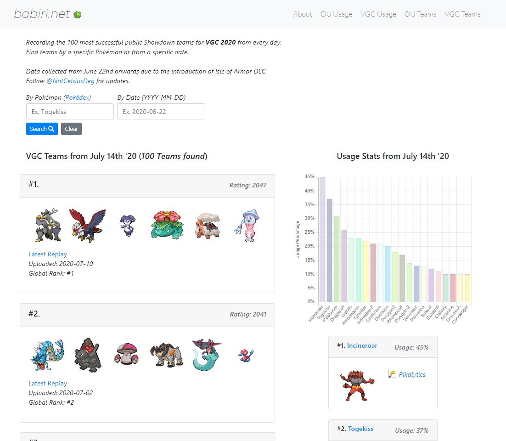
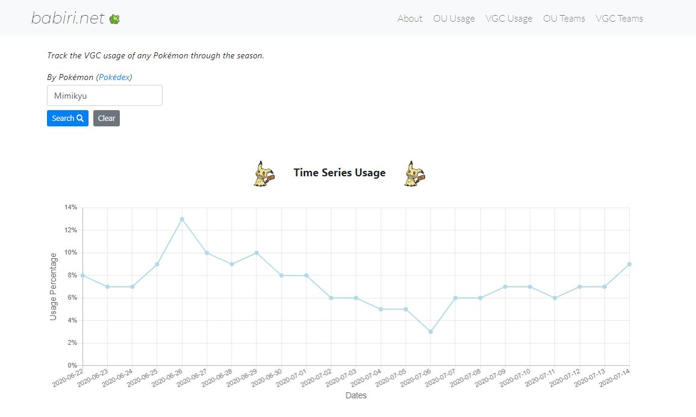
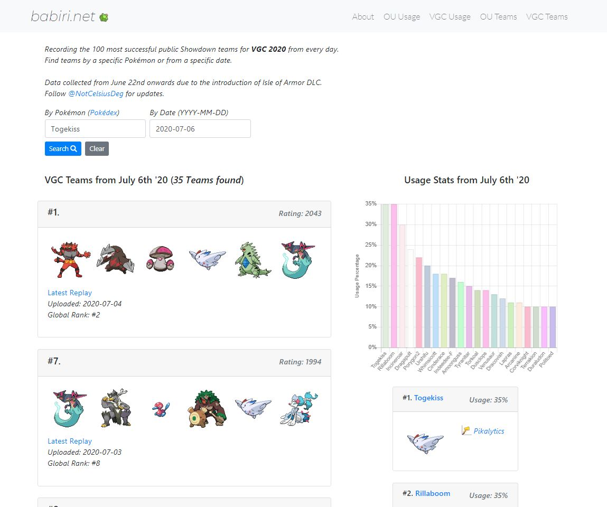
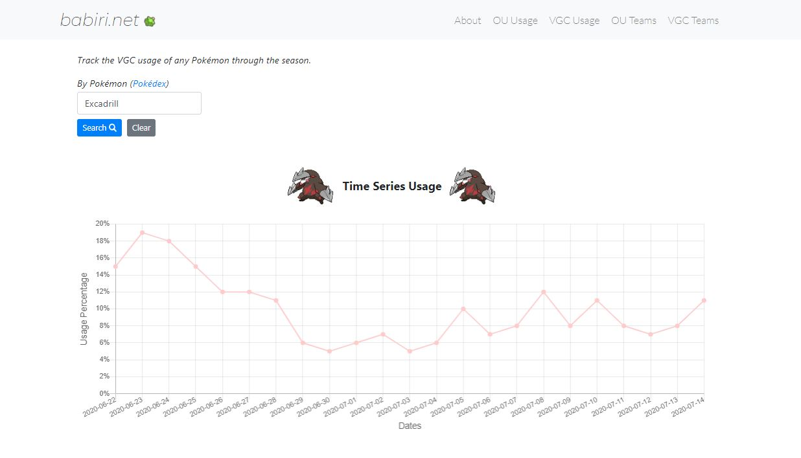

# babiri.net

babiri.net is a Pokémon stats aggregation and visualization website for competitive VGC and OU players.

The website has had over 85,000 users since launch. It has also been featured on [Pokésports Podcast](https://www.youtube.com/watch?v=ZYbqsDLq994). For future updates, please follow [@NotCelsiusDeg](https://twitter.com/NotCelsiusDeg) on Twitter.

## Demo

The live demo can be found [here](https://www.babiri.net/#/).

## About

babiri.net was made to gain insight on daily Pokémon Showdown usage for VGC and OU formats using public replays from the server. The application also provides the percentage of teams that specific Pokémon are featured on, as well as their usage over time through data visualization.

This repository hosts the open-source version of the web application portion. It is a snapshot of the website prior to the OU format addition. As such, security details such as DB connection strings are omitted.

## Getting Started

To run the server, use `npm run dev` in your terminal.

Upon starting, the client-side will be hosted on `localhost:3000` and the server-side will be hosted on `localhost:5000`. You can check the ports by looking at the logs.

### Prerequisites

Please ensure you have Node.js installed, which can be downloaded [here](https://nodejs.org/en/). In addition, the repository does not contain the database connection string for security reasons. To construct your own database, please refer to the models found in `/models`.

## Example Requests

All requests are made using the `GET` method. Both VGC and OU formats follow the same endpoint structure.

VGC uses the `/api/teams` and `/api/usage` endpoints while OU uses `/api/teamsou` and `/api/usageou` endpoints.

### Teams

`/api/teams`: Return the most recent recorded teams.

#### Teams with Specific Pokémon

`/api/teams?pokemon=[POKEMON]`: Return the most recent recorded teams with `POKEMON` on their roster.

Ex. `/api/teams?pokemon=Tyranitar` returns the most recent recorded teams with [Tyranitar](https://www.pokemon.com/us/pokedex/tyranitar).

#### Teams by Specific Date

`/api/teams?date=[DATE]`: Return the teams recorded at the requested `DATE`. `DATE` should be represented by `YYYY-MM-DD`.

Ex. `/api/teams?date=2020-07-13` returns the teams recorded on July 13th, 2020.

#### Teams by Specific Pokémon and Date

You can combine previous parameters to search by both Pokémon and date.

Ex. `/api/teams?pokemon=Togekiss?date=2020-07-06` returns the teams with [Togekiss](https://www.pokemon.com/us/pokedex/togekiss) recorded on July 6th, 2020.

### Usage

`/api/usage?pokemon=[POKEMON]`: Return all usage stats of the requested `POKEMON` starting with the oldest recorded.

Ex. `/api/usage?pokemon=Excadrill` returns the usage stats of [Excadrill](https://www.pokemon.com/us/pokedex/excadrill).

## Built With

*Web Application*
- React (Bootstrap/Chart.js)
- Node
- MongoDB
- Express
- Heroku

*Data Scraping*
- Python (Requests, BeautifulSoup, PyMongo)
- AWS EC2 (cron)

*Sprites*
- [Pokémon Showdown](https://play.pokemonshowdown.com/sprites/)

## Acknowledgements

- [Pokémon Showdown](https://pokemonshowdown.com/)
- [Pikalytics](https://pikalytics.com/)
- [VGC Stats](https://vgcstats.com/#/)

## License

This project is licensed under the terms of the **MIT** license.
